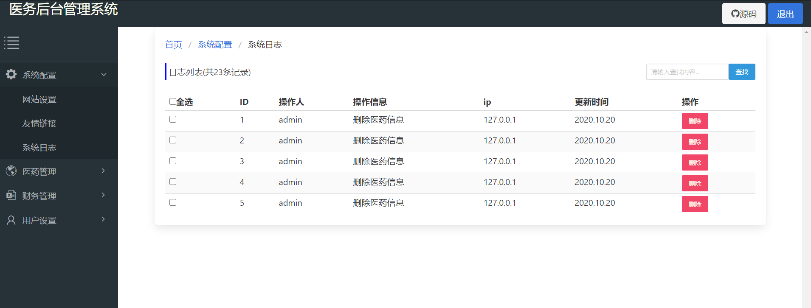
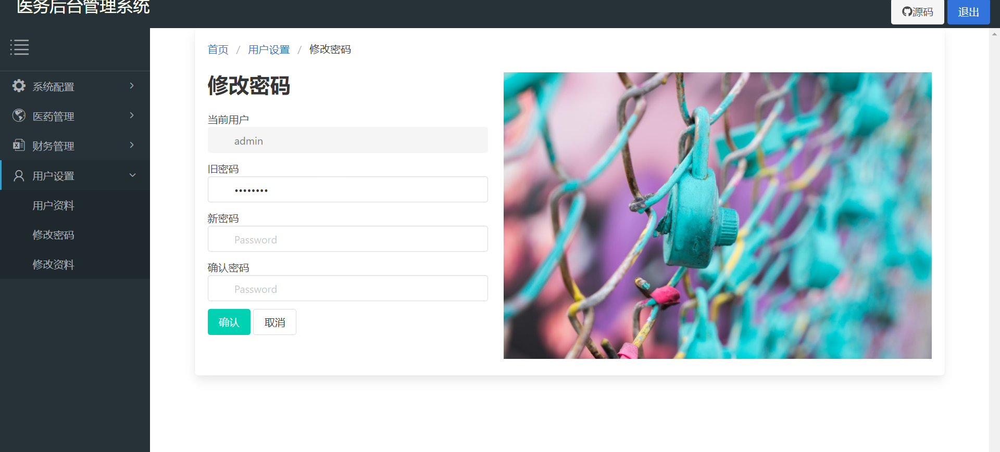

# hospitalManage

##  安装

```shell
# git clone git@github.com:Escher1108/hospitalManage.git
```

## 技术栈

```
jQuery + Bulma + sweetAerltjs + iframe + chart
```

## 项目结构

```shell
├─backpage.html
├─home.html
├─login.html
├─README.md
├─register.html
├─systenRecord.html
├─userSet
|    ├─pwd.html
|    └userinfo.html
├─orders
|   ├─financeInfo.html
|   ├─pay.html
|   └payRecord.html
├─medicine
|    ├─medicInfo.html
|    ├─orderList.html
|    └purchRecord.html
├─font
|  ├─iconfont.css
|  ├─iconfont.eot
|  ├─iconfont.js
|  ├─iconfont.svg
|  ├─iconfont.ttf
|  └iconfont.woff
├─assets
|   ├─js
|   | ├─fontawesome.all.js
|   | ├─jquery.min.js
|   | ├─nav.js
|   | ├─polyfill.min.js
|   | └sweetalert2.min.js
|   ├─images
|   ├─css
|   |  ├─bulma.min.css
|   |  ├─index.css
|   |  ├─login.css
|   |  ├─nav.css
|   |  ├─reg.css
|   |  └sweetalert2.min.css
```


## 预览

#### 首页


#### 财务


#### 日志



#### 修改密码



#### 删除提示


#### 登录


#### 注册

